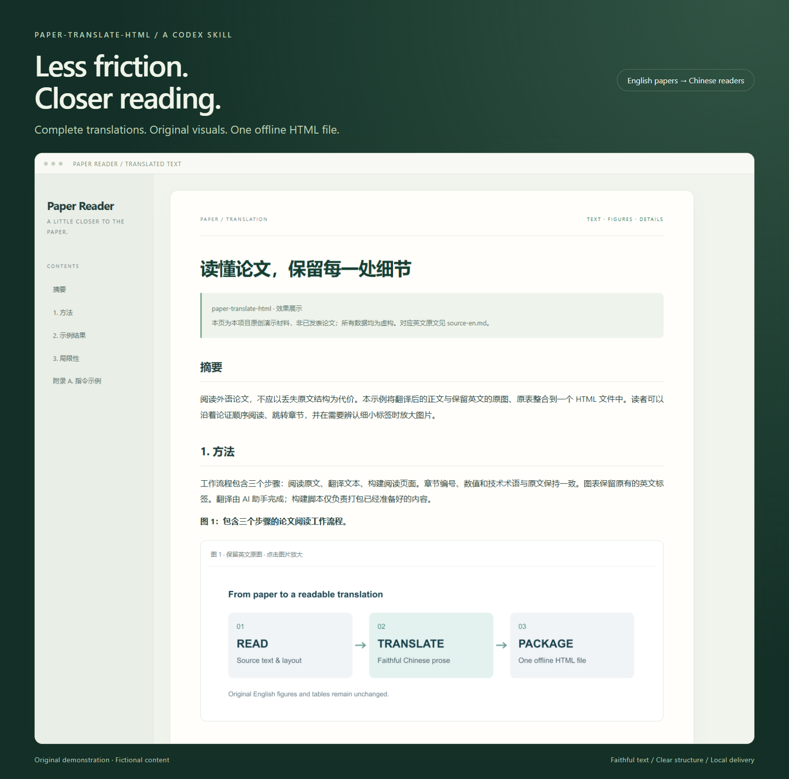
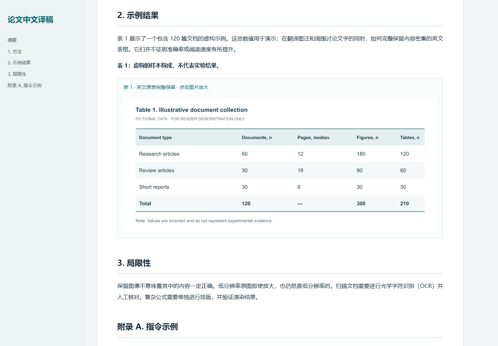
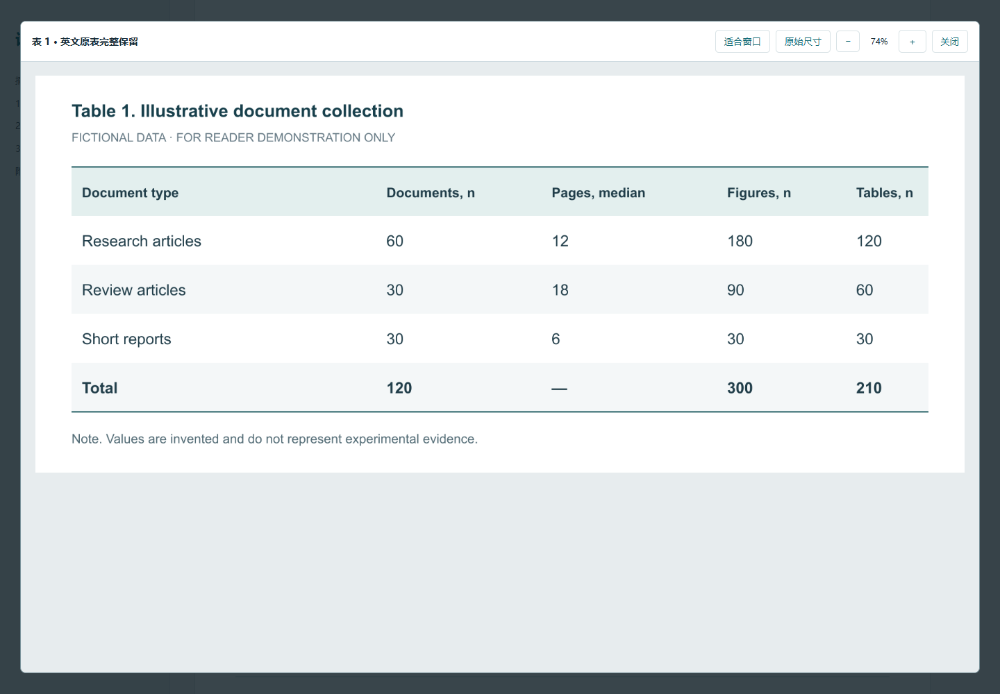
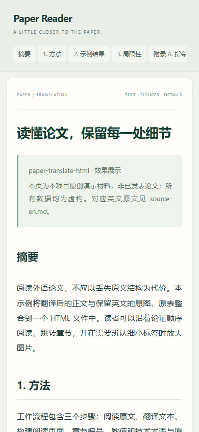

# paper-translate-html

**Translate the paper. Keep the figures. Open one HTML file.**

A Codex skill that turns English research papers into readable Chinese HTML documents. Less copying and formatting, more time for reading.

- **Complete translations:** covers the main text and appendices by default, preserving structure, numbering, and academic meaning.
- **Original figures and tables:** preserves English labels, extracts original images where possible, and renders composite figures at high resolution.
- **Comfortable reading:** chapter navigation, responsive layouts, click-to-zoom, and original-size viewing.
- **Simple delivery:** text, images, styles, and the image viewer bundled into one HTML file for offline reading.

The AI assistant performs the translation. The scripts extract visual assets and package the prepared content; this is not a standalone translation model and requires no separate translation API configuration.

## Preview

These examples use original English and Chinese demonstration material created for this repository. All data are fictional, not research findings or performance benchmarks. Chinese text in the screenshots demonstrates the translated output.

### 1. Readable text and chapter navigation



### 2. Original English figures and tables



### 3. Zoom into details, or read on a narrow screen





Download the [HTML demo](examples/demo-zh.html) and open it in your browser. GitHub's file view displays the source code. Compare the [English source](examples/source-en.md) with the [Chinese translation](examples/demo-zh.md).

## Installation

Clone this repository into your Codex skills directory. If you have configured `CODEX_HOME`, use its `skills` subdirectory instead of the default paths below.

Windows PowerShell:

```powershell
git clone https://github.com/gfnnnb/paper-translate-html.git "$HOME/.codex/skills/paper-translate-html"
cd "$HOME/.codex/skills/paper-translate-html"
npm install
python -m pip install -r requirements.txt
```

macOS / Linux:

```bash
git clone https://github.com/gfnnnb/paper-translate-html.git ~/.codex/skills/paper-translate-html
cd ~/.codex/skills/paper-translate-html
npm install
python -m pip install -r requirements.txt
```

Requires Node.js 20+ and Python 3.10+. Use a Python virtual environment where appropriate, or reuse compatible dependencies already provided by your assistant environment. If a skill with this name already exists, back it up or clone into another directory. Start a new Codex session to use the skill.

Reading the generated HTML requires only a browser.

## Usage

Provide a PDF to your assistant and ask:

```text
Use $paper-translate-html to translate this entire paper into Simplified Chinese
and create an HTML reader. Preserve high-resolution English figures and tables,
with click-to-zoom viewing.
```

You can also request a specific section or an editable Markdown copy. Your requested scope takes priority over the default full-paper translation.

To try the included demo:

```bash
npm run demo
npm test
```

Open `examples/demo-zh.html`. See the [workflow guide](references/workflow.md) for figure extraction and custom build commands.

## Limitations

- Scanned PDFs require additional OCR and checking; OCR is not included.
- Plain Unicode equations display directly. Complex LaTeX requires a separately configured and verified math renderer.
- Enlarging a low-resolution source cannot restore missing details. Many embedded high-resolution images can make the HTML file large.
- Raw manuscript HTML is displayed as text. Missing or remote images cause the build to fail.
- AI translations still need checks for terminology, numerical values, and complex layouts. Completeness checks are part of the skill workflow, not an automatic guarantee from the scripts.

## License

Code, documentation, and original demo materials are available under the [MIT License](LICENSE). This license does not cover user-supplied papers, figures, or other third-party material. Check the relevant permissions before redistributing translations.
